# Keis ImageCompress

> *"In 2077, what makes someone a criminal? Getting caught with uncompressed images."*

A cyberpunk-themed web application for batch compressing JPG and PNG images to a target file size while maintaining optimal quality. Features a **Cyberpunk 2077-inspired** neon UI with glowing cyan accents, yellow highlights, and enough visual glitch effects to make your images feel like they're being processed in Night City. Available as a Docker image for easy deployment.

[](https://hub.docker.com/r/anderskeis/pycompressweb)

## ⚠️ Security Warning

**This application is designed for LOCAL USE ONLY.**

> 🚨 **Do NOT expose this application to the public internet.** 🚨

- No authentication or authorization
- No rate limiting
- No input sanitization beyond basic file type checks
- Temporary files stored on disk
- Session IDs are predictable UUIDs

Keep it behind your firewall, choom. Netrunners are everywhere.

## Features

- 🖼️ **Batch Upload**: Drag & drop or select multiple JPG and PNG images at once
- 🎯 **Target Size**: Specify your desired output file size in KB
- 🔄 **Format Conversion**: Keep original format, or convert to JPG/PNG
- ⚡ **Smart Compression**: Automatically balances quality and resolution to achieve target size
- 🔒 **Quality Floor**: Never drops below 25% quality for both JPG and PNG to maintain image integrity
- 📊 **Detailed Results**: See compression stats for each image (size, resolution, quality used)
- 📦 **ZIP Download**: Download all compressed images in a single ZIP file
- 🗑️ **Clear & Reset**: Clear selected files or start a new session with cache cleanup
- 🎨 **Cyberpunk UI**: Night City-inspired interface with neon glows, glitch effects, and Orbitron typography
- 🐳 **Docker Ready**: Multi-platform Docker image (amd64 & arm64)

## How It Works

The compression algorithm prioritizes quality over resolution reduction:

1. **Quality Adjustment**: Binary search for optimal quality (25-95%) at current resolution
   - JPEG: Uses quality parameter (25-95)
   - PNG: Uses compression level (0-9, mapped from quality 25-95)
2. **Resolution Scaling**: If target can't be met, progressively reduces resolution (90%, 80%, 70%... down to 10%)
3. **Best Fit**: At each resolution, finds the highest quality setting that meets the size target
4. **Quality Floor**: Quality never drops below 25% for either format — your images won't look like they came from a relic terminal
5. **Format Conversion**: Optionally convert between JPG and PNG formats

**Result**: Best possible visual quality under your KB limit.

## Architecture

### System Architecture

```mermaid
graph TB
    User["👤 User Browser"]
    UI["🎨 Cyberpunk UI<br/>HTML/CSS/JavaScript"]
    Flask["⚙️ Flask Backend<br/>Python 3.11"]
    Compress["🖼️ Compression Engine<br/>Pillow Image Processing"]
    Storage["💾 Temporary Storage<br/>/tmp/pycompressweb"]
    Zip["📦 ZIP Creator"]
    Download["⬇️ Download"]
    
    Docker["🐳 Docker Container<br/>Gunicorn Server"]
    
    User -->|HTTP| UI
    UI -->|POST /upload| Flask
    Flask -->|Process Images| Compress
    Compress -->|Save Results| Storage
    Flask -->|GET /download| Zip
    Zip -->|Create Archive| Storage
    Zip -->|Return ZIP| Download
    Download -->|HTTP Response| User
    
    Flask -.->|Runs In| Docker
    Compress -.->|Runs In| Docker
    Storage -.->|Volume| Docker
```



### Compression Algorithm Flow

```mermaid
graph TD
    Start["📥 Image Uploaded"]
    Input["Input Image<br/>Original Quality & Resolution"]
    
    Phase1["⚡ Phase 1: Quality Optimization<br/>Binary Search 25-95%"]
    Quality_Search["At Current Resolution:<br/>Find max quality ≤ target size"]
    
    Decision1{{"Meets Target<br/>Size?"}}
    
    Phase2["🔄 Phase 2: Resolution Scaling<br/>Progressive Reduction"]
    Scale["Try 90% → 80% → ... → 10%<br/>At each scale, find best quality"]
    
    Decision2{{"Meets Target<br/>Size?"}}
    
    Floor["🛑 Apply Quality Floor<br/>Never drop below 25%"]
    
    Result["✅ Output Image<br/>Optimized for target size"]
    End["📊 Return Stats<br/>Size, Resolution, Quality"]
    
    Start --> Input
    Input --> Phase1
    Phase1 --> Quality_Search
    Quality_Search --> Decision1
    
    Decision1 -->|Yes| Floor
    Decision1 -->|No| Phase2
    
    Phase2 --> Scale
    Scale --> Decision2
    
    Decision2 -->|Yes| Floor
    Decision2 -->|No| Floor
    
    Floor --> Result
    Result --> End
```



## Quick Start

### Using Docker Hub Image (Recommended)

```bash
# Pull and run the pre-built image
docker run -d -p 5050:5050 anderskeis/pycompressweb:latest

# Access the web interface
open http://localhost:5050
```

### Using Docker Compose

```bash
# Clone the repo and start
docker compose up -d

# Access the web interface
open http://localhost:5050
```

### Build Locally

```bash
# Build the image
docker build -t pycompressweb .

# Run the container
docker run -p 5050:5050 pycompressweb
```

### Local Development (without Docker)

```bash
# Create virtual environment
python -m venv venv
source venv/bin/activate  # On Windows: venv\Scripts\activate

# Install dependencies
pip install -r requirements.txt

# Run the app
python app.py
```

## Usage

1. Open http://localhost:5050 in your browser
2. Drag & drop your JPG or PNG images onto the upload zone (or click to select)
3. Set your target file size in KB (default: 200 KB)
4. Choose output format: Keep Original, Convert to JPG, or Convert to PNG
5. Click "Compress Images"
6. Review the results showing original vs compressed sizes
7. Click "Download ZIP" to get all optimized images
8. Use "New Session" to clear cache and start fresh

## Configuration

| Setting | Default | Description |
|---------|---------|-------------|
| Port | 5050 | Web server port |
| Max Upload | 100 MB | Maximum total upload size |
| Min Quality | 25% | Quality floor for both JPG and PNG (never goes below this) |
| Max Quality | 95% | Maximum quality for both formats |
| Request Timeout | 600s | Gunicorn timeout for large batches |
| Session Cleanup | 1 hour | Automatic deletion of temporary files |
| LOG_LEVEL | INFO | Logging verbosity (DEBUG, INFO, WARNING, ERROR) |

## Viewing Logs

The application logs all key operations: uploads, compression results, downloads, and security events.

### Log Levels

| Level | What's Logged |
|-------|---------------|
| `DEBUG` | Session creation, cleanup details, algorithm steps |
| `INFO` | Uploads, compression results, downloads, startup |
| `WARNING` | Invalid requests, expired sessions, security rejections |
| `ERROR` | Compression failures, file I/O errors |

### Docker Container Logs

```bash
# Follow logs in real-time
docker logs -f pycompressweb-pycompressweb-1

# View last 100 lines
docker logs --tail 100 pycompressweb-pycompressweb-1

# View logs with timestamps
docker logs -t pycompressweb-pycompressweb-1
```

### Docker Compose Logs

```bash
# Follow logs
docker compose logs -f

# View logs since last hour
docker compose logs --since 1h
```

### Setting Log Level

Set the `LOG_LEVEL` environment variable to control verbosity:

```bash
# In docker-compose.yml
environment:
  - LOG_LEVEL=DEBUG

# Or when running directly
LOG_LEVEL=DEBUG python app.py

# Or with docker run
docker run -e LOG_LEVEL=DEBUG -p 5050:5050 anderskeis/pycompressweb:latest
```

### Example Log Output

```
2026-01-04 14:32:15 - INFO - Keis ImageCompress starting on http://0.0.0.0:5050
2026-01-04 14:32:15 - INFO - Log level: INFO
2026-01-04 14:33:01 - INFO - Upload received: 5 files, target=200KB, format=original
2026-01-04 14:33:02 - INFO - Compressed photo1.jpg: 1500KB → 198KB (quality=85, scale=0.6)
2026-01-04 14:33:03 - INFO - Compressed photo2.png: 2400KB → 195KB (quality=70, scale=0.5)
2026-01-04 14:33:04 - INFO - Session abc12345: Processed 5 images successfully
2026-01-04 14:33:10 - INFO - ZIP download started for session abc12345
2026-01-04 14:35:00 - WARNING - Invalid session ID attempted: ../../../etc/passwd
```

## Deployment Notes

### Reverse Proxy (Nginx)

If running behind Nginx, add these settings for large batch uploads:

```nginx
location / {
    proxy_pass http://localhost:5050;
    proxy_read_timeout 600s;
    proxy_connect_timeout 600s;
    proxy_send_timeout 600s;
    client_max_body_size 100M;
}
```

### Building Multi-Platform Image

To build for both amd64 and arm64:

```bash
docker buildx create --name multiplatform --use
docker buildx build --platform linux/amd64,linux/arm64 -t anderskeis/pycompressweb:latest --push .
```

## Tech Stack

- **Backend**: Python 3.11, Flask 3.0, Pillow 10.2
- **Frontend**: Vanilla HTML/CSS/JavaScript (no build step)
- **Production Server**: Gunicorn
- **Container**: Docker (multi-platform: amd64/arm64)

## License

Do whatever you want :)

---

*"The compression is temporary, but the savings are eternal."* — Johnny Silverhand, probably
